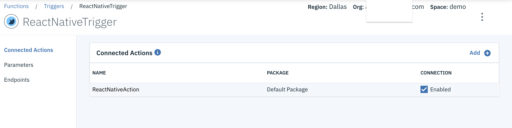
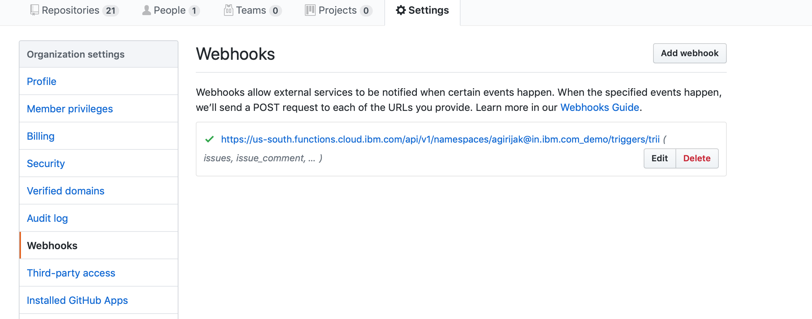
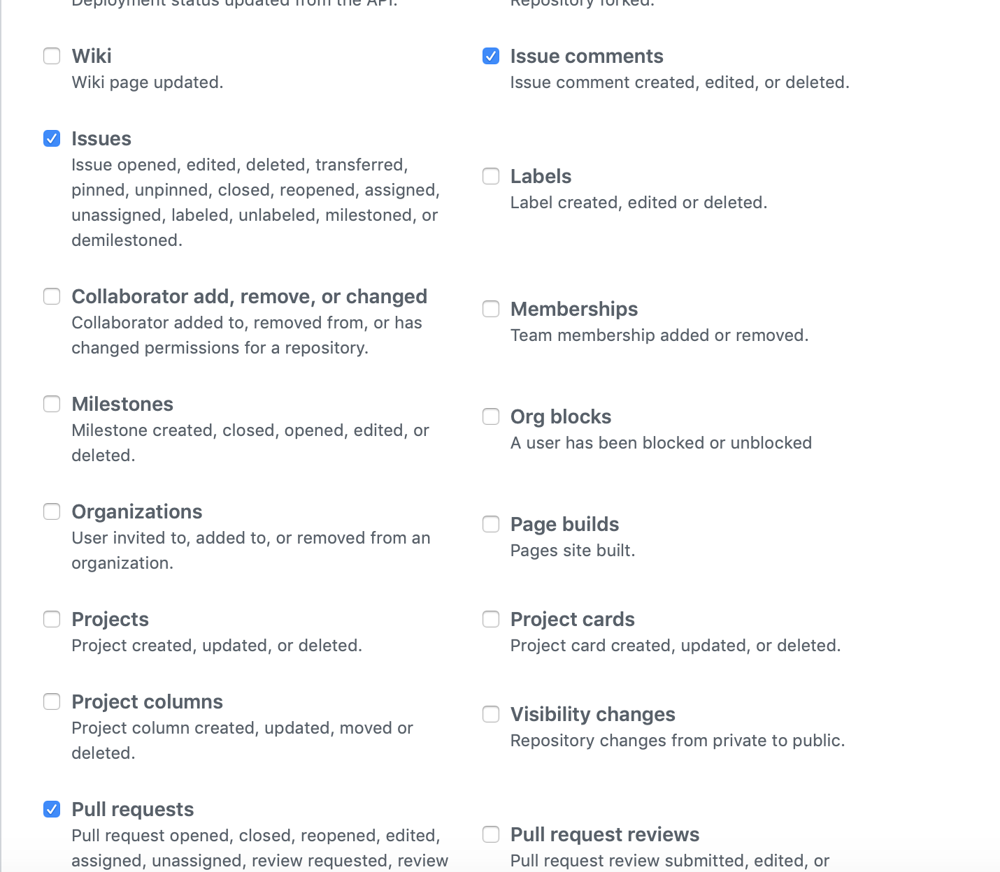
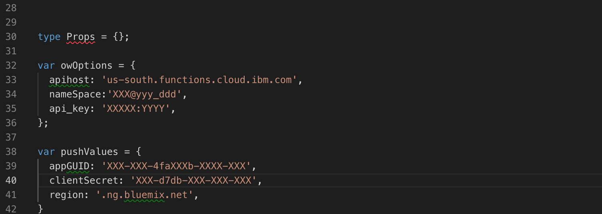

# GitHubMonitor

A simple react native application with [IBM Cloud Push Service](https://console.bluemix.net/docs/services/mobilepush/index.html#gettingstartedtemplate) and [Cloud functions](https://console.bluemix.net/docs/openwhisk/index.html#getting-started-with-openwhisk).

This sample is built on React Native. It is a simple application which shows all repos in a GitHub Organization and send a push notification when an issue or Pull Request is created, updated or Closed.

## Requirements 

- Xcode 10+
- Android: minSdkVersion 16+, compileSdkVersion 28+
- React Native >= 0.57.8
- React Native CLI >= 2.0.1
- IBM Cloud Account 

## Start

Let's start by creating the Cloud Functions Actions and triggers. 

### Cloud Functions

#### Create Action to get all repository . 

Create a nodeJs action with code given in `getReposAction.js`.

Add the github organization name,

```
    let orgName = "Gypsyan";
```

#### Create Action to listen for Github webhooks. 

 Create a nodeJs action with code given in `ReactNativeAction.js`. Make sure you have updated the  

 Add the `apikey`, `appId` and `apiHost` for the push service.

 ```
    var apikey = "Push service APIKey";
    var appId = "Push service AppGUID";
    var apiHost = " Region" // Eg, for US South - imfpush.ng.bluemix.net
 ```

#### Create a Cloud Fucntions trigger.

  Create a trigger and add the `ReactNativeAction` in the actions field.

<p align="center">
  
</p>

#### Add the Github webhook. 

 Open the github repository settings. Then add a webhook with Cloud function trigger. Select `issues` and `Pull Request`.

 <p align="center">
  
  
</p>

Github will trigger the Cloud functions trigger once any issues or pullrequest event happens in the org repos.

### Push Notifications 

#### Configure the push service with Android and iOS details.

 Follow the setup documentation for configuring the [push notification service](https://console.bluemix.net/docs/services/mobilepush/push_step_2.html#push_step_2).

#### Configure the client app.

 Go to the `App.js` and add push credentials and [Cloud function credentials](https://console.bluemix.net/openwhisk/learn/api-key). 

 <p align="center">
  
</p>

#### Configure the iOS App and Android App

 Follow this document to [configure the iOS app](https://github.com/ibm-bluemix-mobile-services/bms-push-react-native#installation).
