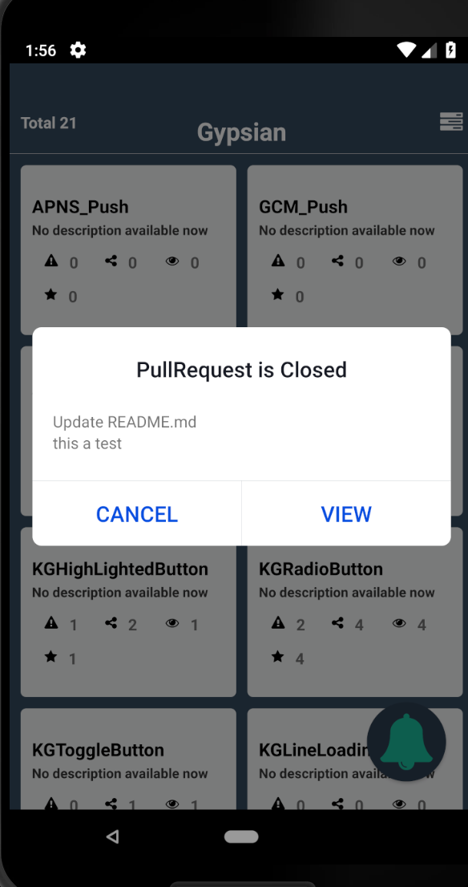

# GitHubMonitor

A simple react native application with [IBM Cloud Push Service](https://console.bluemix.net/docs/services/mobilepush/index.html#gettingstartedtemplate) and [Cloud functions](https://console.bluemix.net/docs/openwhisk/index.html#getting-started-with-openwhisk).

This sample is built on React Native. It is a simple application which shows all repos in a GitHub Organization and send a push notification when an issue or Pull Request is created, updated or Closed.

## Requirements 

- Xcode 10+
- Android: minSdkVersion 16+, compileSdkVersion 28+
- React Native >= 0.57.8
- React Native CLI >= 2.0.1
- IBM Cloud Account 

## Start

Let's start by creating the Cloud Functions Actions and triggers. 

### Cloud Functions

#### Create Action to get all repository . 

Create a nodeJs action with code given in `getReposAction.js`.

Add the github organization name,

```
    let orgName = "Gypsyan";
```

#### Create Action to listen for Github webhooks. 

 Create a nodeJs action with code given in `ReactNativeAction.js`. Make sure you have updated the  

 Add the `apikey`, `appId` and `apiHost` for the push service.

 ```
    var apikey = "Push service APIKey";
    var appId = "Push service AppGUID";
    var apiHost = " Region" // Eg, for US South - imfpush.ng.bluemix.net
 ```

#### Create a Cloud Functions trigger.

  Create a trigger and add the `ReactNativeAction` in the actions field.

<p align="center">
  
</p>

#### Add the Github Webhook

 Open the github repository settings. Then add a webhook with Cloud function trigger. Select `issues` and `Pull Request`.

 <p align="center">
  
  
</p>

Github will trigger the Cloud functions trigger once any issues or pull request event happens in the org repos.

### Push Notifications 

#### Configure the push service with Android and iOS details.

 Follow the setup documentation for configuring the [push notification service](https://console.bluemix.net/docs/services/mobilepush/push_step_2.html#push_step_2).

#### Configure the client app.

 Go to the `App.js` and add push credentials and [Cloud function credentials](https://console.bluemix.net/openwhisk/learn/api-key). 

 <p align="center">
  
</p>

#### Configure the iOS App and Android App

 Follow this document to [configure the iOS and Android app](https://github.com/ibm-bluemix-mobile-services/bms-push-react-native#installation).


## Run the app

 Run your app using `react-native run-ios` or `react-native run-android`. Click on the bell icon to register for push notifications.

The iOS app looks like this,
 <p align="left">
  
  
</p>


The Android app looks like this,
 <p align="left">
  
  
</p>

## Testing app
To test the app , create an issue or Pull request in any repository of your github organization.

The notifications will look like this,
<p align="left">
  
  
  
  
  <br/>
  
  
  
  
</p>


### Learning More

* Visit the **[IBM Cloud Developers Community](https://developer.ibm.com/bluemix/)**.

* [Getting started with IBM MobileFirst Platform for iOS](https://cloud.ibm.com/docs/services/mobilepush/index.html#gettingstartedtemplate)

### Connect with IBM Cloud

[Twitter](https://twitter.com/ibmbluemix) |
[YouTube](https://www.youtube.com/playlist?list=PLzpeuWUENMK2d3L5qCITo2GQEt-7r0oqm) |
[Blog](https://developer.ibm.com/bluemix/blog/) |
[Facebook](https://www.facebook.com/ibmbluemix) |
[Meetup](http://www.meetup.com/bluemix/)


=======================
Copyright 2016 IBM Corp.

Licensed under the Apache License, Version 2.0 (the "License");
you may not use this file except in compliance with the License.
You may obtain a copy of the License at

http://www.apache.org/licenses/LICENSE-2.0

Unless required by applicable law or agreed to in writing, software
distributed under the License is distributed on an "AS IS" BASIS,
WITHOUT WARRANTIES OR CONDITIONS OF ANY KIND, either express or implied.
See the License for the specific language governing permissions and
limitations under the License.
